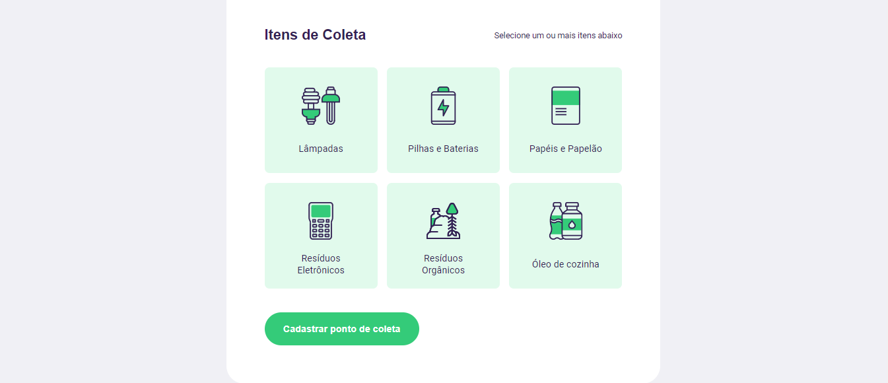

<p align="center">
   <a target="_blank" rel="Ecoleta" href="https://github.com/Rocketseat"></a><br>
</p>

<h1 align="center">Next Level Week</h1> 
<blockquote align="center">Na NLW você irá ter uma leva de desafios a serem cumpridos, aqui eu vou te mostrar o que aprendi nessa semana.</blockquote>
</p>

<h3 align="center">Home do Site</h3>
<p align="center">
   <a target="_blank" rel="Ecoleta" href="https://github.com/Rocketseat"></a><br>
</p>

<h3 align="center">Pagina de Cadastro - Formulário</h3>
<p align="center">
   <a target="_blank" rel="PageCadastro" href="https://github.com/Rocketseat"></a><br>
<h3 align="center">Pagina de Cadastro - Itens de coleta</h3>
<p align="center">
   <a target="_blank" rel="PageCadastro" href="https://github.com/Rocketseat"></a><br>
<h3 align="center">Pagina de Cadastro - Cadastro concluido</h3>
<p align="center">
   <a target="_blank" rel="PageCadastro" href="https://github.com/Rocketseat"></a><br>
<h3 align="center">Pesquisa</h3>
<p align="center">
   <a target="_blank" rel="Search-Results" href="https://github.com/Rocketseat"></a><br>

<h3 align="center">Resultado da Pesquisa</h3>
<p align="center">
   <a target="_blank" rel="Search-Results" href="https://github.com/Rocketseat"></a><br>


## Guia de conteúdo

<li><a href="#recursos">Recursos</a></li><br>
<li><a href="#começando">Como começar?</a></li><br>
<li><a href="#faq">FAQ</a></li><br>
<li><a href="#SemanaNLW">NLW</a></li><br>

## <a id="recursos"></a> Recursos

✅ Pesquise pontos de coleta em sua região!<br>

✅ Cadastre um ponto de coleta para sua empresa.<br>

✅ Cada local tem tipos específicos de residuos a serem coletados, fique atento!<br>


## <a id="começando"></a>  Como começar?

<b> Executando o projeto</b>

Inicie o ambiente de desenvolvimento, em seguida,  navegue em um navegador para o endereço (http://localhost:3000):

````
npm start 
````
## <a id="faq"></a> FAQ

<b>Pergunta:</b> Quais são as tecnologias usadas neste projeto?

<b>Resposta:</b> As tecnologias usadas neste projeto são...

✅ HTML <br>
✅ CSS <br>
✅ JavaScipt


## <a id="nlw"></a> SemanaNLW
<b>Pergunta:</b> Quem proporcionou essa semana incrível de aprendizado?

<b>Resposta:</b> A comunidade que nos proporcionou esse aprendizado foi...

https://github.com/Rocketseat

https://discord.com/invite/NyrRhr8

Entra la pra dar uma olhada!
